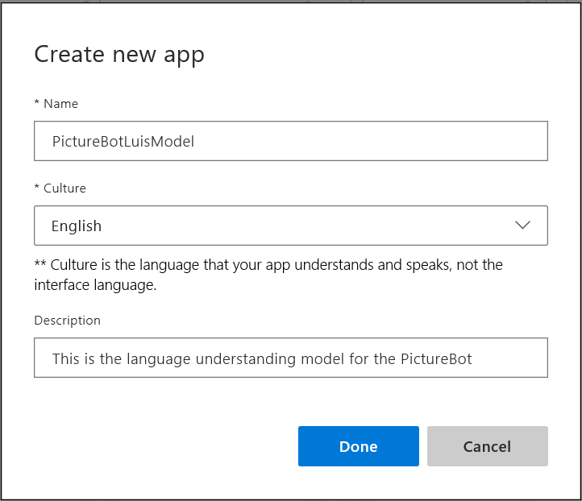
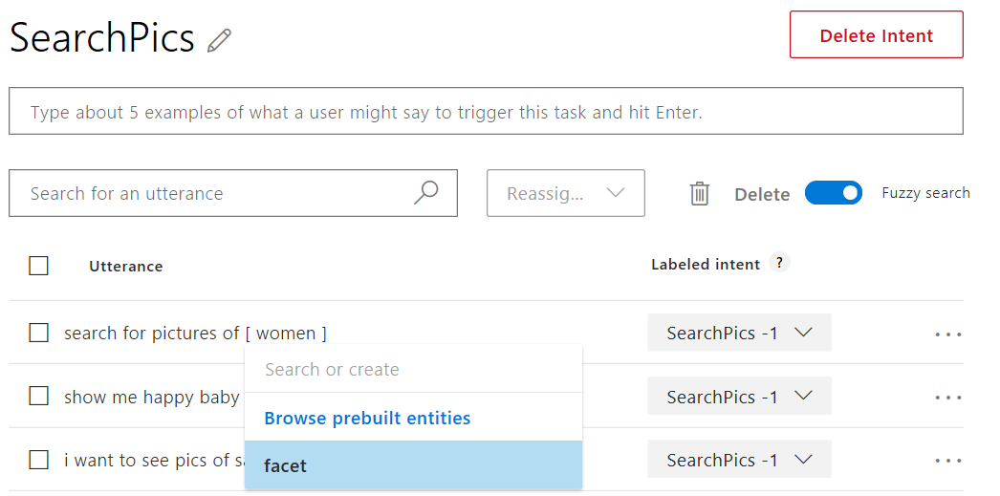
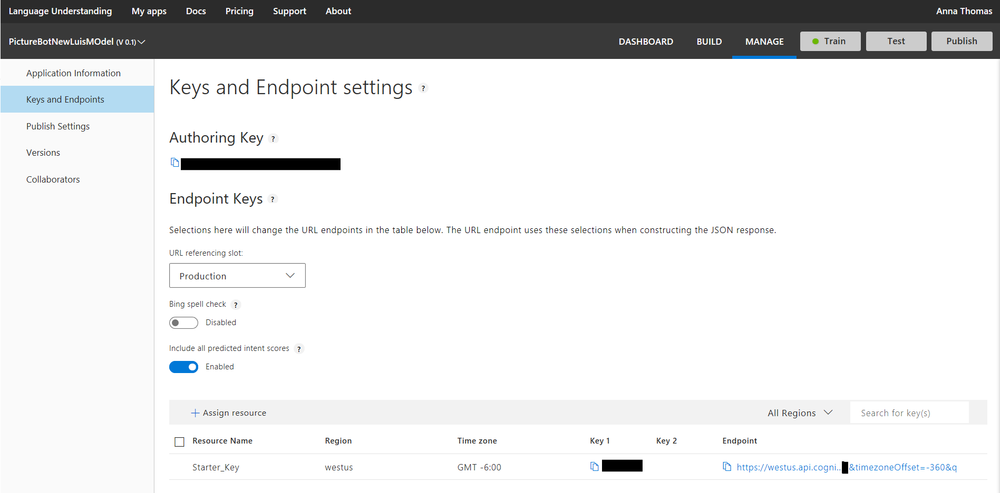

# 1_Luis

Estimated Time: 20-30 minutes

## What LUIS is

First, let's [learn about Microsoft's Language Understand Intelligent Service (LUIS)](https://docs.microsoft.com/en-us/azure/cognitive-services/LUIS/Home).

Now that we know what LUIS is, we'll want to plan our LUIS app. Tomorrow, we'll be creating a bot ("PictureBot") that returns images based on our search, that we can then share or order. We will need to create intents that trigger the different actions that our bot can do, and create entities that require different actions. For example, an intent for our PictureBot may be "SearchPics" and it triggers Azure Search service to look for photos, which requires a "facet" entity to know what to search for. You can see more examples for planning your app [here](https://docs.microsoft.com/en-us/azure/cognitive-services/LUIS/plan-your-app).

Once we've thought out our app, we are ready to [build and train it](https://docs.microsoft.com/en-us/azure/cognitive-services/LUIS/luis-get-started-create-app). These are the steps you will generally take when creating LUIS applications:

  1. [Add intents](https://docs.microsoft.com/en-us/azure/cognitive-services/LUIS/add-intents)
  2. [Add utterances](https://docs.microsoft.com/en-us/azure/cognitive-services/LUIS/add-example-utterances)
  3. [Add entities](https://docs.microsoft.com/en-us/azure/cognitive-services/LUIS/add-entities)
  4. [Improve performance using phrase lists](https://docs.microsoft.com/en-us/azure/cognitive-services/LUIS/add-features) and [patterns](https://docs.microsoft.com/en-us/azure/cognitive-services/LUIS/luis-how-to-model-intent-pattern)
  5. [Train and test](https://docs.microsoft.com/en-us/azure/cognitive-services/LUIS/train-test)
  6. [Review endpoint utterances](https://docs.microsoft.com/en-us/azure/cognitive-services/LUIS/label-suggested-utterances)
  7. [Publish](https://docs.microsoft.com/en-us/azure/cognitive-services/LUIS/publishapp)  

Take some time to review the links referenced to above.

### Lab 1.1: Creating the LUIS service in the portal (optional)

> Note: Creating a LUIS service in the portal is optional, as LUIS provides you with a "starter key" that you can use for the labs. However, if you want to see how to create a free or paid service in the portal, you can follow the steps below.  

In the Portal, hit **Create a resource** and then enter **LUIS** in the search box and choose **Language Understanding**:

This will lead you to fill out a few details for the API endpoint you'll be creating, choosing the API you're interested in and where you'd like your endpoint to reside, as well as what pricing plan you'd like. Put it in a location that is close to you and available. The free tier is sufficient for this lab.  

Once you have created your new API subscription, you can grab the key from the appropriate section of the blade and add it to your list of keys.

### Lab 1.2: Adding intelligence to your applications with LUIS

Let's look at how we can use LUIS to add some natural language capabilities. LUIS allows you to map natural language utterances (words/phrases/sentences the user might say when talking to the bot) to intents (tasks or actions the user wants to perform).  For our application, we might have several intents: finding pictures, sharing pictures, and ordering prints of pictures, for example.  We can give a few example utterances as ways to ask for each of these things, and LUIS will map additional new utterances to each intent based on what it has learned.  

> **Warning**: Though the DSVM uses IE as the default browser, we do not recommend it for LUIS. You should be able to use Firefox (which is already installed on the DSVM) for all of the labs. Alternatively, you can download either [Microsoft Edge](https://www.microsoft.com/en-us/download/details.aspx?id=48126) or [Google Chrome](https://www.google.com/intl/en/chrome/).

Navigate to [https://www.luis.ai](https://www.luis.ai) (**unless you are located in Europe or Australia***) and sign in using your Microsoft account.  (This should be the same account that you used to create the LUIS key in the previous section).  You should be redirected to a list of your LUIS applications.  We will create a new LUIS app to support our bot.

> *If you created a key in a **Europe** region, you will need to create your application at [https://eu.luis.ai/](https://eu.luis.ai/). If you created a key in an **Australia** region, you will need to create your application at [https://au.luis.ai/](https://au.luis.ai/). You can read more about the LUIS publishing regions [here](https://docs.microsoft.com/en-us/azure/cognitive-services/luis/luis-reference-regions).
>
> Fun Aside: Notice that there is also an "Import App" next to the "New App" button on [the current page](https://www.luis.ai/applications).  After creating your LUIS application, you have the ability to export the entire app as JSON and check it into source control.  This is a recommended best practice, so you can version your LUIS models as you version your code.  An exported LUIS app may be re-imported using that "Import App" button.  If you fall behind during the lab and want to cheat, you can click the "Import App" button and import the [LUIS model](./resources/code/LUIS/PictureBotLuisModel.json).  

From the main page, click the "Create LUIS app" button, select your country on the next page, accept the license agreement, and click "Create new app" button on the next page.  Give it a name (I chose "PictureBotLuisModel") and set the Culture to "English".  You can optionally provide a description. Then click "Done".  

You will be taken to the Build section for your new app.

> Note that there is one intent called "None".  Random utterances that don't map to any of your intents may be mapped to "None".  

We want our bot to be able to do the following things:

+ Search/find pictures
+ Share pictures on social media
+ Order prints of pictures
+ Greet the user (although this can also be done other ways, as we will see later)

Let's create intents for the user requesting each of these.  Click the "Create new intent" button.  

Name the first intent "Greeting" and click "Done".  Then give several examples of things the user might say when greeting the bot, pressing "Enter" after each one.  

Let's see how to create an entity.  When the user requests to search the pictures, they may specify what they are looking for.  Let's capture that in an entity.  

Click on "Entities" in the left-hand column and then click "Create new entity".  Give it an entity name "facet" and entity type ["Simple"](https://docs.microsoft.com/en-us/azure/cognitive-services/LUIS/luis-concept-entity-types).  Then click "Done".  

Next, click "Intents" in the left-hand sidebar and then click the "Create new intent" button.  Give it an intent name of "SearchPics" and then click "Done".  

Just as we did for Greetings, let's add some sample utterances (words/phrases/sentences the user might say when talking to the bot).  People might search for pictures in many ways.  Feel free to use some of the utterances below, and add your own wording for how you would ask a bot to search for pictures.

+ Find outdoor pics
+ Are there pictures of a train?
+ Find pictures of food.
+ Search for photos of boys playing
+ Please give me pics of business women
+ Show me beach pics
+ I want to find dog photos
+ Search for pictures of men indoors
+ Show me pictures of men wearing glasses
+ I want to see pics of sad boys
+ Show me happy baby pics

Once we have some utterances, we have to teach LUIS how to pick out the **search topic** as the "facet" entity. Whatever the "facet" entity picks up is what will be searched. Hover and click the word (or click consecutive words to select a group of words) and then select the "facet" entity.

So your utterances may become something like this when facets are labeled:

Next, click "Intents" in the left sidebar and add two more intents:

+ Name one intent **"SharePic"**.  This might be identified by utterances like "Share this pic", "Can you tweet that?", or "post to Twitter".

+ Create another intent named **"OrderPic"**.  This could be communicated with utterances like "Print this picture", "I would like to order prints", "Can I get an 8x10 of that one?", and "Order wallets".  
When choosing utterances, it can be helpful to use a combination of questions, commands, and "I would like to..." formats.  

Finally, you need to add some sample utterances to the "None" intent. This helps LUIS label when things are outside the scope of your application. Add things like "I'm hungry for pizza", "Search videos", etc. You should have about 10-15% of your app's utterances within the None intent.  

We are now ready to train our model.  Click "Train" in the top right bar.  This builds a model to do utterance --> intent mapping with the training data you've provided. Training is not always immediate. Sometimes, it gets queued and can take several minutes.

Next, click on "Manage" in the top bar. You'll have several options on the left side of the window (Application Information, Keys and Endpoints, Publish Settings, Versions, Collaborators). You can read more about the various publish options [here](https://docs.microsoft.com/en-us/azure/cognitive-services/LUIS/PublishApp).

If you completed the optional step of creating a LUIS service in the portal, select or add (by clicking the "Assign Resource" button towards the bottom of the page on the "Keys and Endpoints" tab) the endpoint key that you set up earlier, or follow the link to add a key from your Azure account 
(for testing and learning purposes, you can also just use the "Starter_Key", which is why creating the LUIS service was optional). You can leave the endpoint slot as "Production".  Then click "Publish" in the top bar. You'll have the option to publish to your "Production" or "Staging" endpoint. Select "Production", and [read about the reasons for the two endpoints](https://docs.microsoft.com/en-us/azure/cognitive-services/luis/luis-concept-version). Finally, click "Publish".  

  

Publishing creates an endpoint to call the LUIS model.  The URL will be displayed, which will be explained in a later lab. For now, you can copy the Endpoint URL and add it to your list of keys.  

Click on "Test" in the top right bar. Try typing a few utterances and see the intents returned. Familiarize yourself with [interactive testing](https://docs.microsoft.com/en-us/azure/cognitive-services/LUIS/Train-Test#interactive-testing) and [reviewing endpoint utterances](https://docs.microsoft.com/en-us/azure/cognitive-services/LUIS/luis-how-to-review-endoint-utt) as you may want to do this now or in a future lab.

One quick example is shown below. I have noticed that my model incorrectly assigned "send me a swimming photo" as SharePic, when it should be SearchPics. I reassigned the intent.

Now I need to retrain my app by selecting the Train button. I then tested the same utterance and compared the results between my recently trained and previously published model. Remember, you'll have to republish your model to see updates in the application that uses the model.

You can also [test your published endpoint in a browser](https://docs.microsoft.com/en-us/azure/cognitive-services/LUIS/PublishApp#test-your-published-endpoint-in-a-browser). Copy the Endpoint URL. To open this URL in your browser, set the URL parameter `&q=` to your test query. For example, append `Find pictures of dogs` to your URL, and then press Enter. The browser displays the JSON response of your HTTP endpoint.

If you still have time, spend time exploring the www.luis.ai site. Select "Prebuilt domains" and see [what is already available for you](https://docs.microsoft.com/en-us/azure/cognitive-services/luis/luis-reference-prebuilt-domains). You can also review some of the [other features](https://docs.microsoft.com/en-us/azure/cognitive-services/luis/luis-concept-feature) and [patterns](https://docs.microsoft.com/en-us/azure/cognitive-services/luis/luis-concept-patterns)
, and check out the [BotBuilder-tools](https://github.com/Microsoft/botbuilder-tools) for creating LUIS models, managing LUIS models, simulating conversations, and more. Later, you may also be interested in [another course that includes how to design LUIS schema](https://aka.ms/daaia).

Back to [README](./0_README.md)
